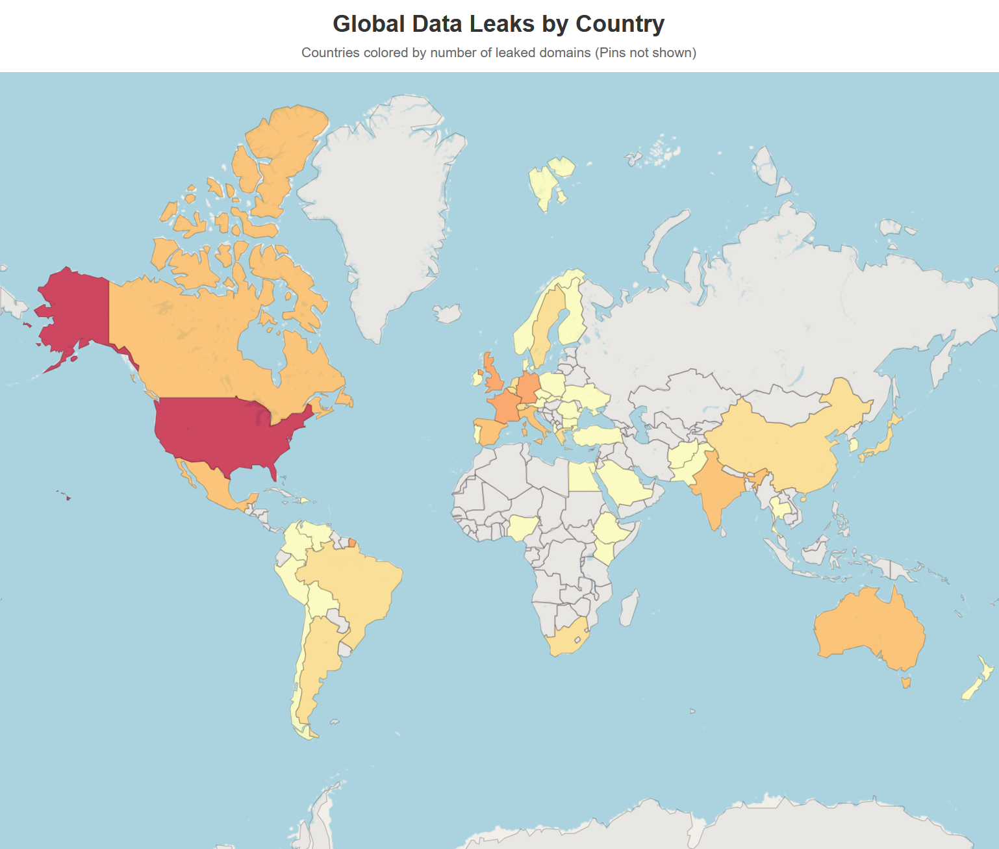

# Leak Map

This repository presents my analysis and visualization of target patterns across multiple ransomware groups. I focused on financially motivated threat actors rather than politically motivated or activist groups to ensure data quality and reduce bias in the findings.

## Abstract

This project aggregates public leak-site postings from selected groups and maps victims by country. When country data is missing or ambiguous, country is inferred from context with an LLM. Interactive maps and population-normalized views help contextualize relative impact. A recurring pattern is the low frequency of victims in post-Soviet countries, plausibly because many ransomware developers originate from those regions and tend to avoid local targets.

## Data and methods

- Sources: leak-site postings from the following groups (selected to avoid politically motivated actors):
  - LockBit
  - 3am
  - DragonForce
  - Quilin
  - RansomHouse
- Collection and parsing:
  - Raw lists collected from actor webpages (`Data/Raw/`).
  - Parsers in `Utils/` normalize records; some sources rely on custom scripts (e.g., `Utils/clop_parser.py`).
  - When country data was missing or ambiguous, an LLM inferred country from context (company name, description). Outputs are under `Data/Parsed/`.
- Harmonization and enrichment:
  - Standardized country names via `Utils/country_mapping.py`.
  - World population data (`Data/geodata/worldpopulation.csv`) for normalization.
  - GeoJSON boundaries (`Data/geodata/geojson.json`) for mapping.
- Aggregation and visualization:
  - Per-source datasets merged with `Utils/merger.py` into combined tables in `Data/combined/`.
  - Country-level choropleths and point maps generated with Folium (`Generators/`), including population-normalized variants.

## Tools

- Python libraries: pandas, folium, requests, pydantic
- LLM assistance: Ollama for country inference when source data is missing
- Data I/O: CSV/JSON in; HTML maps out

## Findings

- In the sampled period and sources, clustering appears in North America and Central Europe.
- Post-Soviet countries appear rarely in victim lists, consistent with developers avoiding local targets.
- Population normalization dampens high-population dominance and highlights smaller countries with comparatively high counts.
- Luxembourg shows the highest leaks per million inhabitants due to 2 incidents in such a small country, demonstrating how population normalization can amplify patterns in smaller nations.

## Preview

Combined countries view:



Population-normalized view:


Open live examples (HTML):

- `Maps/combined/leak_map_countries.html`
- `Maps/combined/leak_map_countries_against_pop.html`
- `Maps/individual/leak_map_countries_lockbit.html`
- `Maps/individual/leak_map_countries_dragonforce.html`

## Reproducibility (how to run)

Requirements are listed in `requirements.txt`. On Windows PowerShell:

1. Create and activate a virtual environment (optional but recommended).
2. Install dependencies.
3. Run a generator script to produce maps.

Example (PowerShell):

```
python -m venv .venv; .\.venv\Scripts\Activate.ps1; pip install -r requirements.txt; python .\Generators\combined\country_full_merged.py
```

Outputs will be written under `Maps/`.

Per-source examples (optional):

- `python .\Generators\individual\leak_map_generator_lockbit.py`
- `python .\Generators\individual\leak_map_generator_dragonforce.py`
- `python .\Generators\individual\leak_map_generator_quilin.py`
- `python .\Generators\individual\leak_map_generator_Ransomhouse.py`
- `python .\Generators\individual\leak_map_generator_3am.py`

## Project layout

- `Data/` raw, parsed, combined datasets and geodata
- `Generators/` scripts that produce the HTML maps (combined and per source)
- `Maps/` generated interactive maps you can open in a browser
- `Utils/` helpers for parsing, merging, and country name mapping
- `img/` static screenshots used in this README

## Limitations and ethics

- Inference errors: Country extraction (human and LLM-assisted) can misclassify entities with global footprints.
- Coverage bias: Only specific groups and a time slice of postings are included; leak-site data can be incomplete or manipulated.
- Usage of .com domains: Websites from all over the world use .com domains. This causes either the AI or me to misclassify them as US or Unknown in some cases.

## AI usage

AI was used heavily in this write-up and the development of the tools:
- Code might not be fully checked for security. Always check code first before running it yourself!
- This write-up might sound a bit robotic, since English is not my first language
- AI might have misclassified countries which caused data to not be fully consistent

### Coding
- Claude Sonnet 4
- GPT-5

### Classification
- granite3.1-dense:2b

## Credits
- GeoJSON: https://geojson.org/
- World Population: https://data.worldbank.org/indicator/SP.POP.TOTL
- Group Info: https://www.ransomlook.io/recent